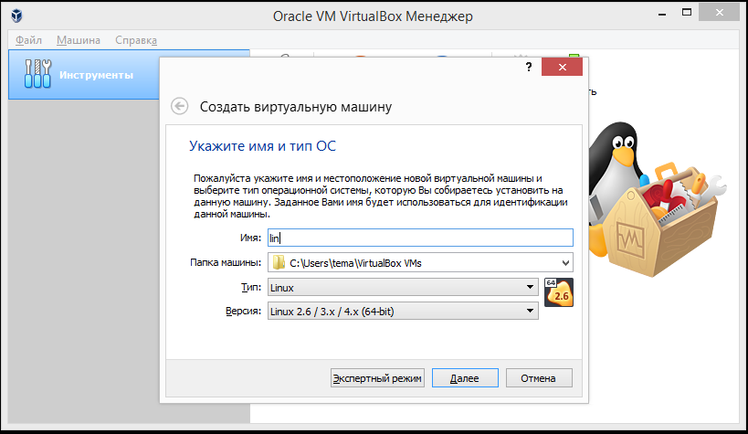

---
## Front matter
lang: ru-RU
title: Презентация по лабораторной №1
subtitle: Установка и конфигурация операционной системы
author:
  - Лушин А.А.
institute:
  - Российский университет дружбы народов, Москва, Россия
  - Факультет Физико-математических и естественных наук
date: 18 feb 2005

## i18n babel
babel-lang: russian
babel-otherlangs: english

## Formatting pdf
toc: false
toc-title: Содержание
slide_level: 2
aspectratio: 169
section-titles: true
theme: metropolis
header-includes:
 - \metroset{progressbar=frametitle,sectionpage=progressbar,numbering=fraction}
 - '\makeatletter'
 - '\beamer@ignorenonframefalse'
 - '\makeatother'
---

# Информация

## Докладчик

:::::::::::::: {.columns align=center}
::: {.column width="70%"}

  * Лушин Артем Андреевич
  * Бакалавр направления математика-механика
  * ученик математического института
  * Российский университет дружбы народов
  * [Lusin5745@gmail.com](lusin5745@gmail.com)
  * <TG: @temo4ka>

:::
::: {.column width="30%"}

:::
::::::::::::::

## Цели и задачи

- Целью данной работы является приобретение практических навыков установки операционной системы на виртуальную машину, настройки минимально необходимых для дальнейшей работы сервисов

#  Ход работы

## Установка виртуальной машины

Первым этапом мы устанавливаем программу (VirtualBox) на наш пк, настроиваем и создаем новую виртуальную машину. Добавляем в раздел контроллер, диск для установки, настраиваем нужные данные (объем памяти, разрешения, жесткий диск) и запускаем машину.

:::
::::::::::::::

## Установка операционной системы

Запускаем установку самой операционной системы. Настраиваем время, язык, регион, жесткий диск, куда сохраняются все данные и начинаем загрузку.

.png)

## Создание аккаунт на новой ОС

После окончания загрузки, регистрируем аккаунт, как в дисплейных классах (ник аккаунта - первая буква имени, первая буква отчества и фамилии), в моем случаи aalushin. Устанавливаем пароль и настраиваем раскладку, время, фон и тд.

.png)

## Установка доп пакетов для комфортной работы

После создания аккаунт, нам необходимо установить дополнительные пакеты, для более комфортной работы. Например, такие программы как tmux,mc,gh,pip и тд. 

.png)

## Установка TexLive и pandoc

Для создания отчетов, каких-либо текстовых файлов, нам необходимо установить pandoc,pandoc-crossref,TExLive. После установки нужно перенсти их в определенные каталоги, проверить соотношение версий(не все версии подходят друг к другу).

.png)

# Контрольные вопросы

## Предоставить ответы на контрольные вопросы.

Какую информацию содержит учётная запись пользователя?

Укажите команды терминала и приведите примеры:
для получения справки по команде;
для перемещения по файловой системе;
для просмотра содержимого каталога;
для определения объёма каталога;
для создания / удаления каталогов / файлов;
для задания определённых прав на файл / каталог;

для просмотра истории команд.

Что такое файловая система? Приведите примеры с краткой характеристикой.

Как посмотреть, какие файловые системы подмонтированы в ОС?

Как удалить зависший процесс?

# Вывод

## Вывод

Я приобрел практические навыки установки ос на виртуальную машину, настроил минимально необходимые сервисы

:::

