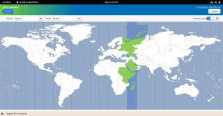

---
## Front matter
title: "Лабораторная работа 1"
subtitle: "Установка ос Linux"
author: "Лушин Артем Андреевич"

## Generic otions
lang: ru-RU
toc-title: "Содержание"

## Bibliography
bibliography: bib/cite.bib
csl: pandoc/csl/gost-r-7-0-5-2008-numeric.csl

## Pdf output format
toc: true # Table of contents
toc-depth: 2
lof: true # List of figures
lot: true # List of tables
fontsize: 12pt
linestretch: 1.5
papersize: a4
documentclass: scrreprt
## I18n polyglossia
polyglossia-lang:
  name: russian
  options:
	- spelling=modern
	- babelshorthands=true
polyglossia-otherlangs:
  name: english
## I18n babel
babel-lang: russian
babel-otherlangs: english
## Fonts
mainfont: PT Serif
romanfont: PT Serif
sansfont: PT Sans
monofont: PT Mono
mainfontoptions: Ligatures=TeX
romanfontoptions: Ligatures=TeX
sansfontoptions: Ligatures=TeX,Scale=MatchLowercase
monofontoptions: Scale=MatchLowercase,Scale=0.9
## Biblatex
biblatex: true
biblio-style: "gost-numeric"
biblatexoptions:
  - parentracker=true
  - backend=biber
  - hyperref=auto
  - language=auto
  - autolang=other*
  - citestyle=gost-numeric
## Pandoc-crossref LaTeX customization
figureTitle: "Рис."
listingTitle: "Листинг"
lofTitle: "Список иллюстраций"
lolTitle: "Листинги"
## Misc options
indent: true
header-includes:
  - \usepackage{indentfirst}
  - \usepackage{float} # keep figures where there are in the text
  - \floatplacement{figure}{H} # keep figures where there are in the text
---

# Цель работы

Целью данной работы является приобретение практических навыков установки операционной системы на виртуальную машину, настройки минимально необходимых для дальнейшей работы сервисов.

# Выполнение лабораторной работы

1) Я создал новую виртуальную машину с именем "LIN"

{#fig:001 width=70%}

2)Указываем объем памяти равный 4096мб.

.png){#fig:002 width=70%}

3)Создание виртуального жесткого диска.

.png){#fig:003 width=70%}

4) Указание типа VDI.

.png){#fig:004 width=70%}

5) Динамика жесткого диска.

.png){#fig:005 width=70%}

6) Память для десткого диска.

.png){#fig:006 width=70%}

7)Настройка видеопамяти.

.png){#fig:007 width=70%}

8) Подключаем файл Fedora для скачивания ОС.

.png){#fig:008 width=70%}

9)Запуск виртуальной машины.

.png){#fig:009 width=70%}

10)Выбор региональных настроек.

.png){#fig:010 width=70%}

11) Выбор региона и города.

{#fig:011 width=70%}

12) Выбор локального диска.

.png){#fig:012 width=70%}

13) Загрузка операционной системы.

.png){#fig:012 width=70%}

14)Установка пароля пользователя.

.png){#fig:013 width=70%}

15) Ввод данных пользователя.

.png){#fig:014 width=70%}

16) Выключение ос, после регистрации пользователя

.png){#fig:015 width=70%}

17) После установки изымаем образ диска.

.png){#fig:018 width=70%}

18)Обновление всех пакетов

.png){#fig:019 width=70%}

.png){#fig:020 width=70%}

19) Установка программы для удобства работы.

.png){#fig:021 width=70%}

20)Установка программного обеспечения для автоматического обновления.

.png){#fig:022 width=70%}

21)Запуск таймера

.png){#fig:023 width=70%}

22) Настройка и проверка пользователя и хоста.

.png){#fig:024 width=70%}

23)Проверка установки pandoc и TexLive (установлены с прошлых лабораторных работ, проверка наличия)

.png){#fig:025 width=70%}

# Домашнее задание

1) Просмотр команды dmesg

.png){#fig:026 width=70%}

2)Получение некоторой информации о компьютере.

.png){#fig:027 width=70%}

# Контрольные вопросы

1) Какую информацию содержит учётная запись пользователя?
Имя пользователя (user name)

Индентификационный номер пользвателя (UID)

Индентификационный номер группы (GID)

Пароль (password)

Полное имя (full name)

Домашний каталог (home directory)

Начальную оболочку (login shell)

2) Укажите команды терминала и приведите примеры:

для получения справки по команде --help

для перемещения по файловой системе -cd

для просмотра содержимого каталога -ls

для определения объёма каталога du <имя директории>

для создания / удаления каталогов / файлов - mkdir -создание, rm -r - удаление

для задания определённых прав на файл / каталог - touch/rm

для просмотра истории команд -history

3) Что такое файловая система? Приведите примеры с краткой характеристикой.

Файловая система - порядок, определяющий способ организации,хранения и наименования данных на носителях иации в пк, а также в другом электронном оборудовании: цифровых фотоаппаратах, мобильных телефона и тд. Файловая система определяет формат содержимого и способ физического хранения информации, которую пинято группировать в виде файлов. Конкретная файловая система и раздел, набор атрибутов файла. Некоторые файловые системы представляют сервисные возможности, например, разграничение доступа или цифрование файлов.

4)Как посмотреть, какие файловые системы подмонтированы в ОС?

Df - утилита, показывающая список всех файловых систем по имени устройства, сообщает их размер, занятое и свободное пространство и точки монтирования. При выполнении бещ аргумента, команда mount выведет все подключенные данные.

5)Как удалить зависший процесс?

С помощью команды killall-killall (<название зависшего процесса>).

# Выводы

Я приобрел практическое навыки установки ос на виртуальную машину, настроил минимально необходимые для дальнейшей работы сервисы.

# Список литературы{.unnumbered}

::: {#refs}
:::
