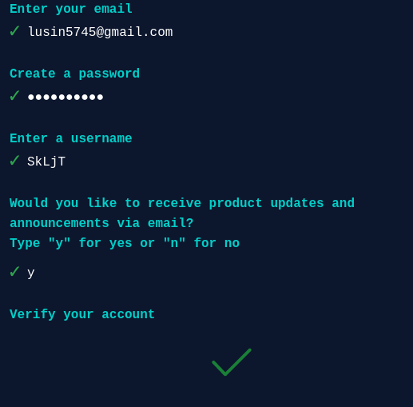
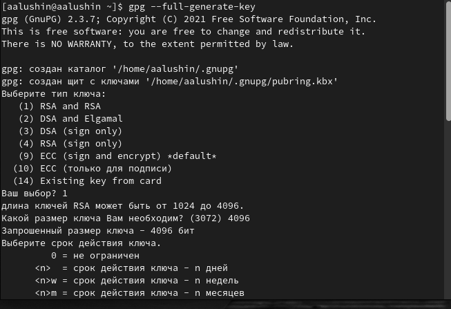
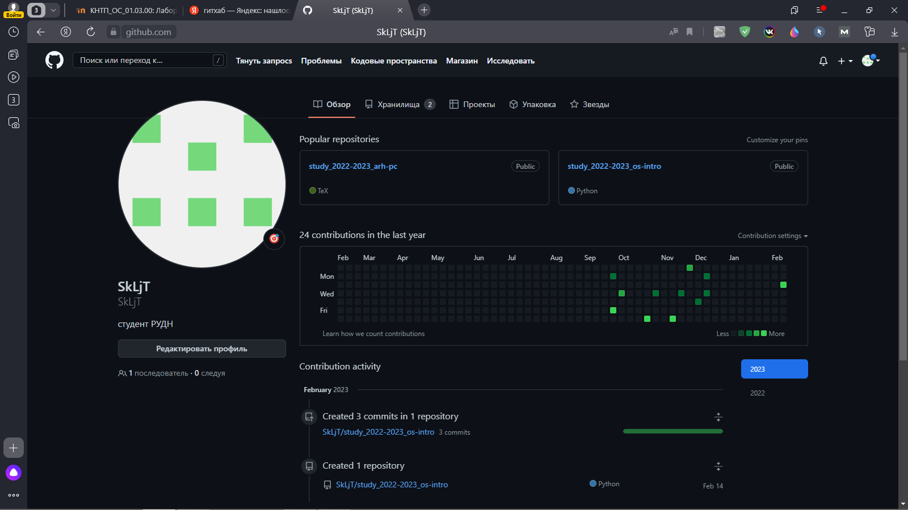

---
## Front matter
lang: ru-RU
title: Презентация по лабораторной работе №2
subtitle: Настройки git
author:
  - Лушин А.А.
institute:
  - Российский университет дружбы народов, Москва, Россия
  - факультет физико-математических и естественных наук
date: 18 февраля 2005

## i18n babel
babel-lang: russian
babel-otherlangs: english

## Formatting pdf
toc: false
toc-title: Содержание
slide_level: 2
aspectratio: 169
section-titles: true
theme: metropolis
header-includes:
 - \metroset{progressbar=frametitle,sectionpage=progressbar,numbering=fraction}
 - '\makeatletter'
 - '\beamer@ignorenonframefalse'
 - '\makeatother'
---

# Информация

## Докладчик

:::::::::::::: {.columns align=center}
::: {.column width="70%"}

  * Лушин Артем Андреевич
  * бакалавр направления математика-механика
  * ученик математического института
  * Российский университет дружбы народов
  * [lusin5745@gmail.com](lusin5745@gmail.com)
  * <inst: _temo4ka>

:::
::: {.column width="30%"}

:::
::::::::::::::

# Вводная часть

## Цели и задачи

- Изучить идеологию и применение средств контроля версий.
- Освоить умения по работе с git.

# Ход работы

## Создание аккаунта на github.

Для работы с системой git необходимо для начала создать аккаунт на сайте. Вводим почту, ник, пароль и проходим аудентификацию.

## Cоздаем ssh-ключ

В терминале системы линукс создаем ssh- ключ. Настраиваем данные для его создания, копируем публичный ключ и вставляем в спеицальный раздел keys на сайте git.

.png)

## Создаем gpg- подпись.

С помощью gh создаем gpg - подпись. В терминале в разделе gh вводим все данные и подтверждаем действия на сайте git. После создания ключа копируем отпечаток и переносим в раздел keys на сайте.

## Создаем репозиторий

После создания ssh - ключа и gpg -подписи, мы создаем репозиторий, через консоль. Созданные репозиторий начнет отображаться на сайте. Далее создаем нужные каталоги на компьютере и переносим туда репозиторий с сайта.

## Отправка данных

Для окончания настройки, после того как настроили локальный репозиторий, мы очищаем его от лишних данных и с помощью комбинаций команда: git add ., git commit -am '', git push, мы отправляем измененный репозиторий на сайт, там он тоже изменится.

.png)

:::

# Контрольные вопросы

## Контрольные вопросы

Что такое системы контроля версий (VCS) и для решения каких задач они предназначаются?

Объясните следующие понятия VCS и их отношения: хранилище, commit, история, рабочая копия.

Что представляют собой и чем отличаются централизованные и децентрализованные VCS?

Приведите примеры VCS каждого вида.

Опишите действия с VCS при единоличной работе с хранилищем.

Опишите порядок работы с общим хранилищем VCS.

Каковы основные задачи, решаемые инструментальным средством git?

Назовите и дайте краткую характеристику командам git.

Приведите примеры использования при работе с локальным и удалённым репозиториями.

Что такое и зачем могут быть нужны ветви (branches)?

Как и зачем можно игнорировать некоторые файлы при commit?

# Заключение

## Вывод

- Я изучил идеологию и пременения средств контроля версий.
- Я освоил умения по работе с git.

:::

