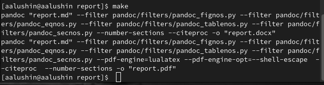
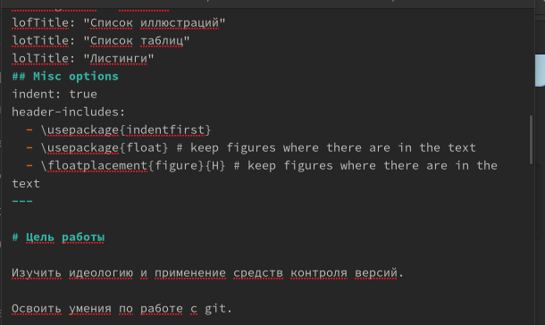
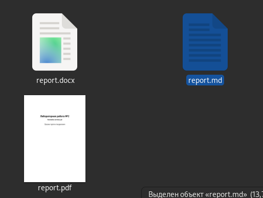

---
## Front matter
lang: ru-RU
title: Презентация по лабораторной работе №3
subtitle: Markdown
author:
  - Лушин А.А.
institute:
  - Российский университет дружбы народов, Москва, Россия
  - Факультет Физико-математических и естественных наук
date: 18 февраля 2005

## i18n babel
babel-lang: russian
babel-otherlangs: english

## Formatting pdf
toc: false
toc-title: Содержание
slide_level: 2
aspectratio: 169
section-titles: true
theme: metropolis
header-includes:
 - \metroset{progressbar=frametitle,sectionpage=progressbar,numbering=fraction}
 - '\makeatletter'
 - '\beamer@ignorenonframefalse'
 - '\makeatother'
---

# Информация

## Докладчик

:::::::::::::: {.columns align=center}
::: {.column width="70%"}

  * Лушин Артем Андреевич
  * бакалавр направления математика-механика
  * ученик математического института
  * Российский университет дружбы народов
  * [lusin5745@gmail.com](lusin5745@gmail.com)
  * <@temo4ek>

:::
::: {.column width="30%"}

:::
::::::::::::::

# Вводная часть

## Цели и задачи

- Научиться оформлять отчёты с помощью легковесного языка разметки Markdown.

# Ход работы

## Установка pandoc и Texlive

Для начала работы устанавливаем pandoc, pandoc-crossref для работы с текстовым редактором. Переносим в нужные папки, чтобы файлы читались в нужном порядке. Устанавливаем TexLive со всеми пакетами для полного функционирования программы.

.png)

## Проверка работоспособности 

Заходим в папку report, предварительно загрузив ее с системы git. Для проверки работоспособности вводим команду "make" и ожидаем. У нас должны создаться файлы report.pdf и report.docx. Если оба файла создались без ошибок, переходим к созданию отчета.

## Заполнение отчета

После проверки работоспособности, начинаем заполнять отчет в файле report.md. Вводим ФИО автора, тему лабораторной и тд. По желанию подлючаем библиотеки или шрифты, если хотим изменить оформление. Расписываем каждый пункт, используя специальный синтаксис markdown.

## Завершение отчета

После написания отчета, сохраняем изменения и вводим команду "make" для создания файлов. После того как файлы скомпелируются, можем проверить правильность выполнения отчетов. Мы получим файлы report.pdf и report.docx, отвечающий за файл pdf и docx соответственно. 

:::

# Результаты

## Вывод

Я научился оформлять отчет с помощью легковесного языка разметки Markdown.

## Цитатка

-Устал? 

-отдохни, но первым уже не будешь...

