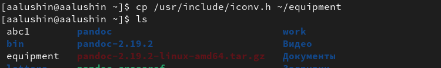
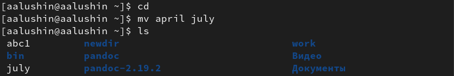
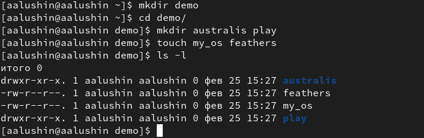
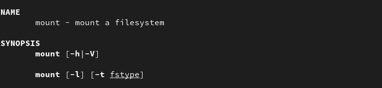

---
## Front matter
lang: ru-RU
title: Лабораторная работа №5
subtitle: Анализ файловой системы Linux. Команды для работы с файлами и каталогами
author:
  - Лушин А.А.
institute:
  - Российский университет дружбы народов, Москва, Россия
  - Факультет Физико-математических и естественных наук
date: 18 февраля 2005

## i18n babel
babel-lang: russian
babel-otherlangs: english

## Formatting pdf
toc: false
toc-title: Содержание
slide_level: 2
aspectratio: 169
section-titles: true
theme: metropolis
header-includes:
 - \metroset{progressbar=frametitle,sectionpage=progressbar,numbering=fraction}
 - '\makeatletter'
 - '\beamer@ignorenonframefalse'
 - '\makeatother'
---

# Информация

## Докладчик

:::::::::::::: {.columns align=center}
::: {.column width="70%"}

  * Лушин Артем Андреевич
  * бакалавр направления математика-механика
  * ученик математического института
  * Российский университет дружбы народов
  * [lusin5745@gmail.com](lusin5745@gmail.com)
  * <@temo4ek>

:::
::: {.column width="30%"}

:::
::::::::::::::

# Вводная часть

## Цели и задачи

- Ознакомление с файловой системой Linux, её структурой, именами и содержанием
каталогов. Приобретение практических навыков по применению команд для работы
с файлами и каталогами, по управлению процессами (и работами), по проверке использования диска и обслуживанию файловой системы.

# Ход работы

## Команда cp

Команда cp исользуется для копирования файлов и каталогов. С помощью этой команды можно переименовывать файл или каталог при переносе. Если нужно скопировать каталог, добавляется функция -r

## Команда mv

Эта команда используется для переноса файлов или каталогов. Как и в случае с cp мы можем переименовывать файл или каталог, когда его переносим.

## Команда chmod.

Команда chmod используется для изменения разрешений файлов или каталогов. Мы можем изменить разрешения для владельца, группа, к которой принадлежит владелец и всех остальных. С помощью ютой команды мы можем дать или забрать право на: чтение, запись и выполнения файла.

## Команда man

С помощью команды man я узнал для чего используются mount, fsck, mkfs, kill. Команда mount открывает системы файлов. man fsck служит для проверки наличия системы файлов.С помощью команды mak kill мы можем остановить любой процесс. А команда я 
man mkfs нужна для создания систем файлов.

# Результат

## Вывод

Я ознакомился с файловой системой, ее структурой и содержанием. Приобрел практические навыки по применению команд для рабты с файлами и каталогами.

## Цитатка

Не откладывай на завтра то, что можно сделать сегодня.

