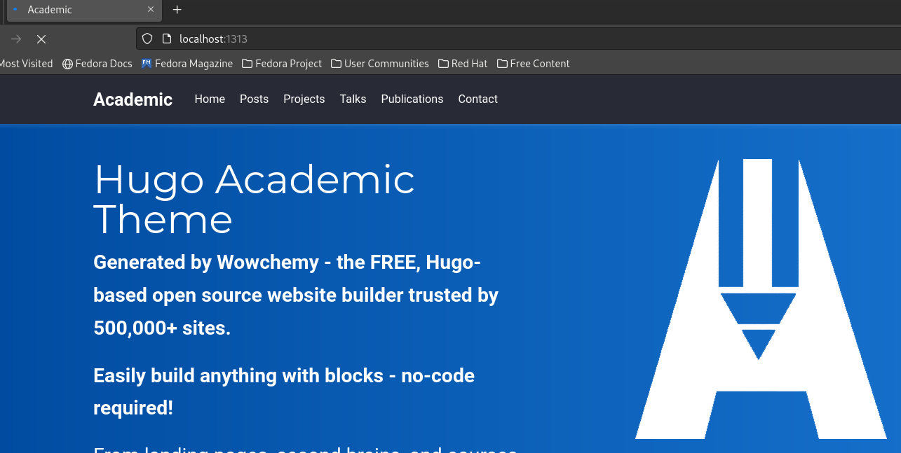
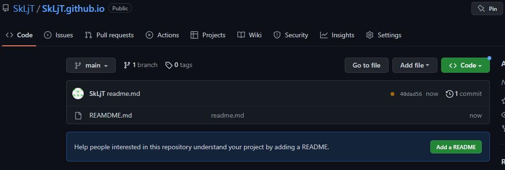
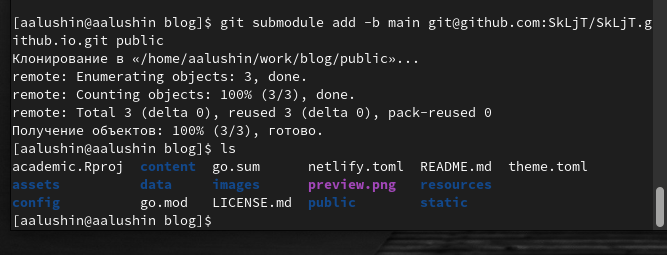
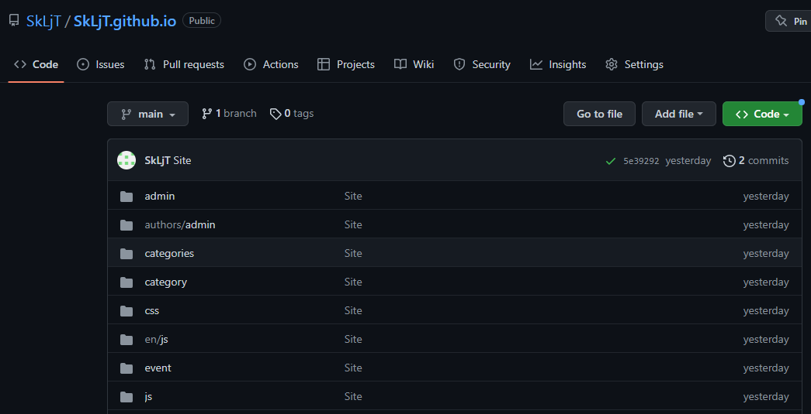

---
## Front matter
lang: ru-RU
title: Презентация по индивидуальному проекту. 1 этап.
subtitle: Заготовка для сайта.
author:
  - Лушин А.А.
institute:
  - Российский университет дружбы народов, Москва, Россия
  - Фикультет Физико-математических и естественных наук.
date: 18 февраля 2005

## i18n babel
babel-lang: russian
babel-otherlangs: english

## Formatting pdf
toc: false
toc-title: Содержание
slide_level: 2
aspectratio: 169
section-titles: true
theme: metropolis
header-includes:
 - \metroset{progressbar=frametitle,sectionpage=progressbar,numbering=fraction}
 - '\makeatletter'
 - '\beamer@ignorenonframefalse'
 - '\makeatother'
---

# Информация

## Докладчик

:::::::::::::: {.columns align=center}
::: {.column width="70%"}

  * Лушин Артем Андреевич
  * бакалавр направления математика-механика
  * ученик математического института
  * Российский университет дружбы народов
  * [lusin5745@gmail.com](lusin5745@gmail.com)

:::
::: {.column width="30%"}

:::
::::::::::::::

# Вводная часть

## Цели и задачи

- Размещение заготовок для сайта на платформе Github.

# Ход работы

## Создание первого репозитория

Для начала работы нам необходимо создать репозиторий (шаблон в ТУИС). Далее переносим этот репозиторий себе на компьютер, проверяем все ли перенеслось и проверяем работу команды "hugo"

.png)

## Создание локального сайта

После переноса репозитория, вводим команду "hugo server" и у нас создается локальный сайт. Мы можем копировать ссылку и проверить работу сайта. Далее убираем синее предупреждение через файл "_index.md".

## Заходим на сайт github и создам новый репозиторий. Имя данного репозитория должно совпадать с именем аккаунта Github. Переносим этот репозиторий на копмьютер и создаем основную ветку main и файла Readme.md.

## В консоли объединяем оба репозитория, могут появиться ошибки, поэтому исправляем их и объединяем репозитории.

## После объединения отправляем оба репозитория обратно на сайт и проверяем, чтобы все файлы отправились правильно.

## Теперь мы можем проверить работу сайта. Чтобы перейти на сайт, нам нужно ввести имя второго репозитория, который мы сами создали. В моем случае это "SkLjT.github.io". Нас перенесет на сайт, доступ к которму будет у всех, кто знает ссылку. 

.png)

# Результаты

## Вывод

Я разместил заготовки для сайта на платформе github.

## Цитатка

Талант без тяжелой работы - ничто

И нет таких, кому просто везет.

